# Workflow Playbook for Device Configuration Backup

## 1. Introduction

This document provides a comprehensive guide to using the Ansible playbook for automating device configuration backups within Cisco Catalyst Center. This playbook is compatible with Catalyst Center Release 2.3.7.6 and later.

### 1.1. Purpose

The primary purpose of this workflow is to ensure the secure and reliable backup of network device configurations for future reference or restoration.

### 1.2. Key Features

* **Flexible Backup Options:**
    * Backup devices by hostname.
    * Backup devices by IP address.
    * Backup devices by MAC address.
    * Backup devices by serial number.
    * Backup devices by site name.
    * Backup devices by collection status.
    * Backup devices by family.
    * Backup devices by series.
    * Backup all devices.
* **Password Management:** Supports backups with or without password encryption.
* **Automated Workflow:** Streamlines the backup process using Ansible.
* **Input Validation:** Integrates with Yamale for schema validation.

### 1.3. Important Considerations

* **Catalyst Center Compatibility:** Ensure your Catalyst Center version is 2.3.7.6 or later.
* **Inventory and Variables:** Accurate configuration of inventory and input variables is crucial.
* **Input Validation:** Validate input using Yamale to prevent errors.
* **Log Review:** Regularly review execution logs for troubleshooting.

## 2. Prerequisites

### 2.1. Ansible Environment

* Install Ansible (version 9.9.0 or later recommended).
* Ensure network connectivity to your Catalyst Center instance.
* Clone the project and playbooks: `git@github.com:cisco-en-programmability/catalyst-center-ansible-iac.git`

### 2.2. Catalyst Center Host Inventory

* Configure the `host_inventory_dnac1/hosts.yml` file with your Catalyst Center connection details (IP address, credentials, etc.).
* Verify that the `dnac_version` in the file matches your Catalyst Center version.

#### 2.2.1. Sample `host_inventory_dnac1/hosts.yml`

```yaml
catalyst_center_hosts:
  hosts:
    catalyst_center220:
      dnac_host: xx.xx.xx.xx
      dnac_password: XXXXXXXX
      dnac_port: 443
      dnac_timeout: 60
      dnac_username: admin
      dnac_verify: false
      dnac_version: 2.3.7.6
      dnac_debug: true
      dnac_log_level: INFO
      dnac_log: true
```
## 3. Workflow Execution

### 3.1. Input Configuration

* Configure the `workflows/device_config_backup/vars/device_config_backup_workflow_input.yml` file with your specific device backup requirements.
* Refer to the official documentation for detailed information: [https://galaxy.ansible.com/ui/repo/published/cisco/dnac/content/module/device_configs_backup_workflow_manager](https://galaxy.ansible.com/ui/repo/published/cisco/dnac/content/module/device_configs_backup_workflow_manager)

### 4. Input Validation (Recommended)

* Validate the input against the schema using Yamale:

```bash
yamale -s workflows/device_config_backup/schema/device_config_backup_workflow_schema.yml workflows/device_config_backup/vars/device_config_backup_workflow_input.yml
```

### 5. Running the Playbook:
#### **Collect device running configurations through Catalyst Center APIs.**
```bash
ansible-playbook -i host_inventory_dnac1/hosts.yml workflows/device_config_backup/playbook/device_config_backup_workflow_playbook.yml \
--e VARS_FILE_PATH=../vars/device_config_backup_workflow_input.yml -vvvv
```

## III. Detailed steps to perform

### 1. Take Backup Using Hostname

#### **Mapping config to UI Actions**

- The config parameter within this task corresponds to the Provision > Inventory > Actions > Export Inventory" action in the Cisco Catalyst Center UI.
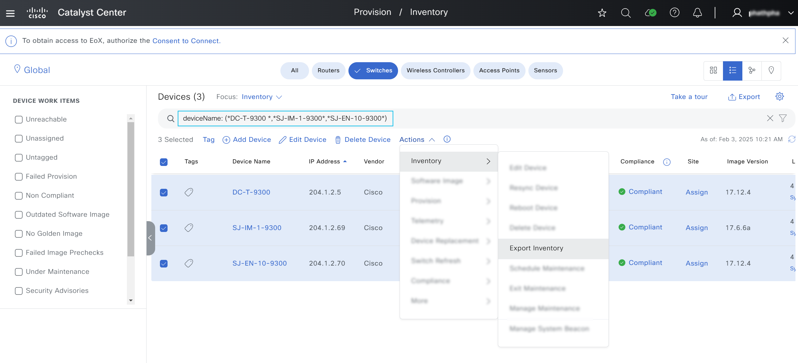
- Enter password and click Export
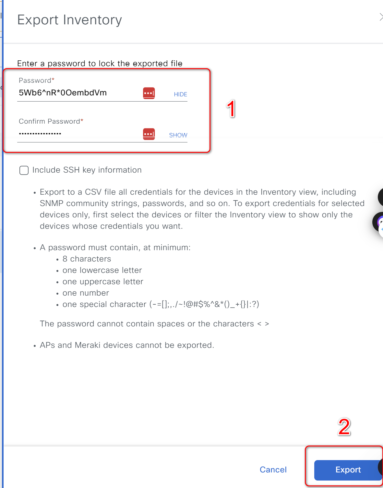

#### **Example Input**

```
hostname:
  - file_password: qsaA12!asdasd
    hostname_list: ['DC-T-9300','SJ-IM-1-9300','SJ-EN-10-9300']
    file_path: "./"
```

- file_password: The password used to encrypt the backup file.
- hostname_list: A list of hostnames for which the device configurations will be backed up.
- file_path: The directory path where the backup files will be stored.


### 2. Take Backup Without Defined Passwords


#### **Example Input **

```
device_configs_backup_details:
  - hostname_list: ['DC-T-9300.cisco.local']
    file_path: "./"
```
- hostname_list: A list of hostnames for which the device configurations will be backed up.
- file_path: The directory path where the backup files will be stored.

### 3. Take Backup with ip_address_list
#### **Mapping config to UI Actions**

- The config parameter within this task corresponds to the Provision > Inventory > Actions > Export Inventory" action in the Cisco Catalyst Center UI.

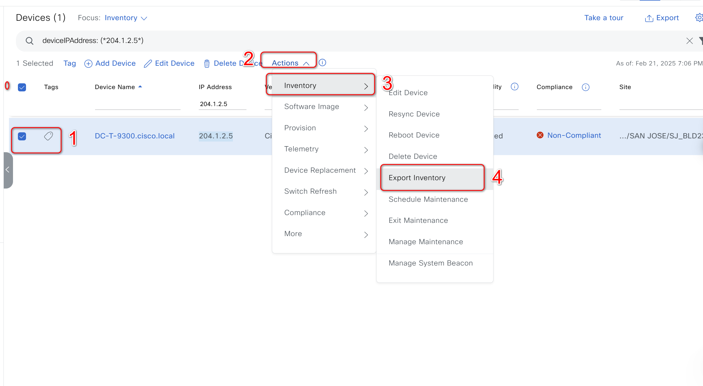

- Enter password and click Export

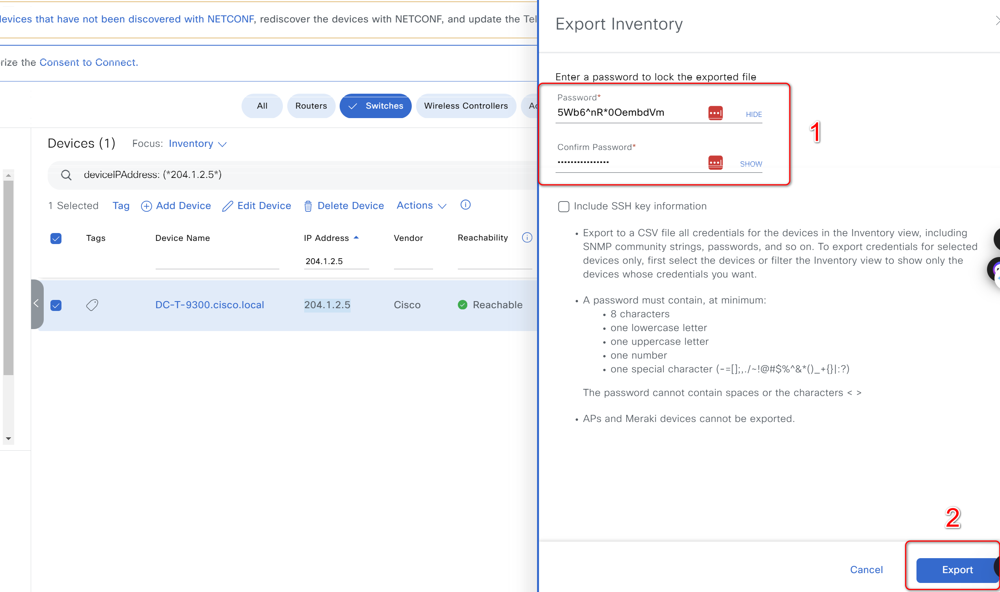
#### **Example Input **

```
device_configs_backup_details:
  - ip_address_list: [204.1.2.5]
    file_path: "./"
    unzip_backup: true
```
- ip_address_list: A list of ipaddress for which the device configurations will be backed up.
- file_path: The directory path where the backup files will be stored.

### 4. Take Backup with collection_status_list
#### **Mapping config to UI Actions**

- The config parameter within this task corresponds to the Provision > Inventory > Actions > Export Inventory" action in the Cisco Catalyst Center UI.

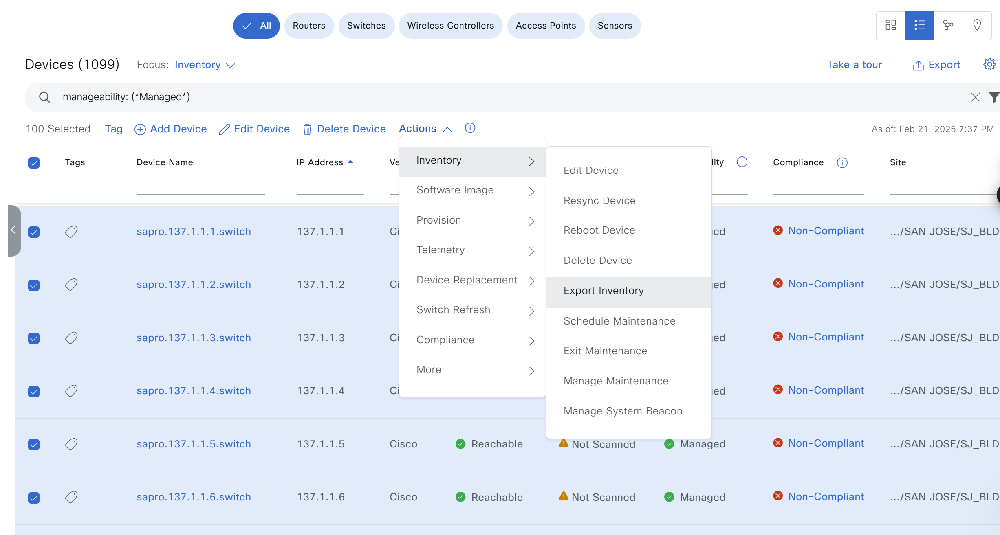

- Enter password and click Export


#### **Example Input **

```
device_configs_backup_details:
  - collection_status_list: [Managed]
    file_path: "./"
```
- collection_status_list: A list of manage status for which the device configurations will be backed up.
- file_path: The directory path where the backup files will be stored.


### 5. Take Backup with family_list
#### **Mapping config to UI Actions**

- The config parameter within this task corresponds to the Provision > Inventory > Actions > Export Inventory" action in the Cisco Catalyst Center UI.

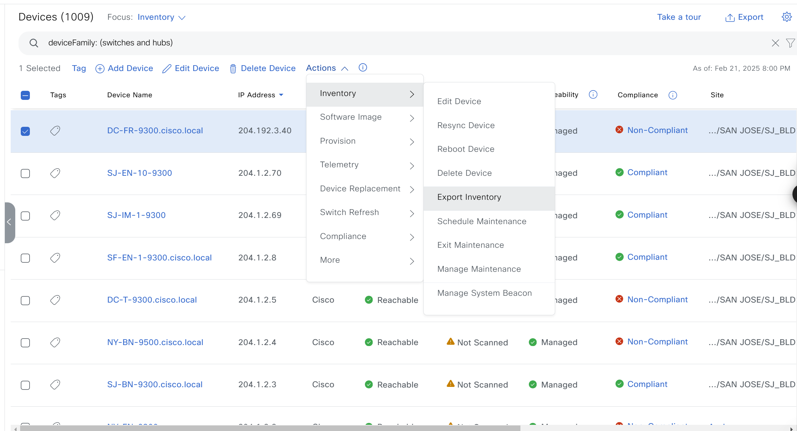

- Enter password and click Export


#### **Example Input **

```
device_configs_backup_details:
  - family_list: [Switches and Hubs]
    file_path: "./"
```
- family_list: A list of family list for which the device configurations will be backed up.
- file_path: The directory path where the backup files will be stored.


### 6. Take Backup with mac_address_list
#### **Mapping config to UI Actions**

- The config parameter within this task corresponds to the Provision > Inventory > Actions > Export Inventory" action in the Cisco Catalyst Center UI.

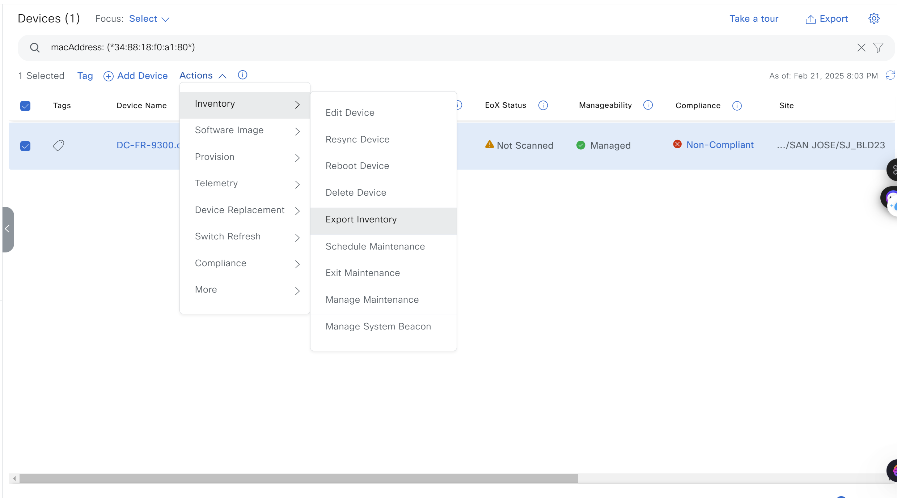

- Enter password and click Export


#### **Example Input **

```
device_configs_backup_details:
  - mac_address_list: ['34:88:18:f0:a1:80']
    file_path: "./"
```
- mac_address_list: A list of mac-address for which the device configurations will be backed up.
- file_path: The directory path where the backup files will be stored.

### 7. Take Backup with serial_number_list
#### **Mapping config to UI Actions**

- The config parameter within this task corresponds to the Provision > Inventory > Actions > Export Inventory" action in the Cisco Catalyst Center UI.

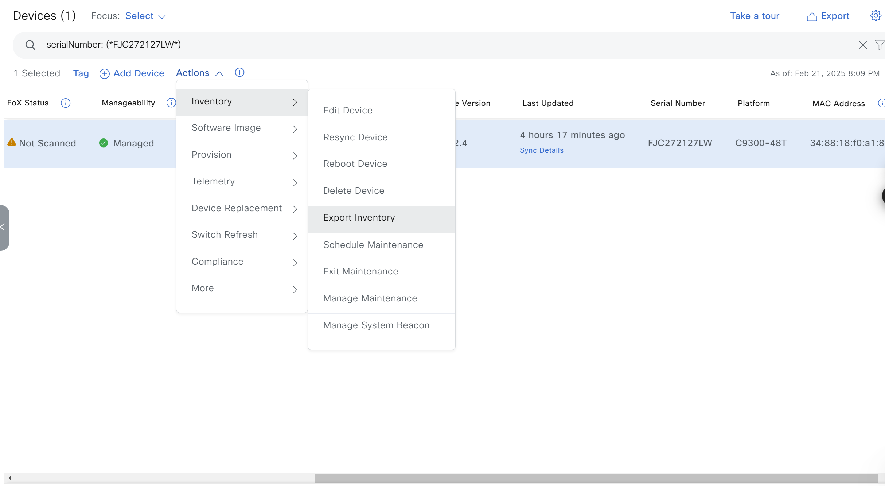

- Enter password and click Export


#### **Example Input **

```
device_configs_backup_details:
  - serial_number_list: ['FJC272127LW]'
    file_path: "./"
```
- serial_number_list: A list of serial number for which the device configurations will be backed up.
- file_path: The directory path where the backup files will be stored.

### 8. Device Configurations Backup Using Series
#### **Mapping config to UI Actions**

- UI Mapping: Provision > Inventory > Actions > Export Inventory

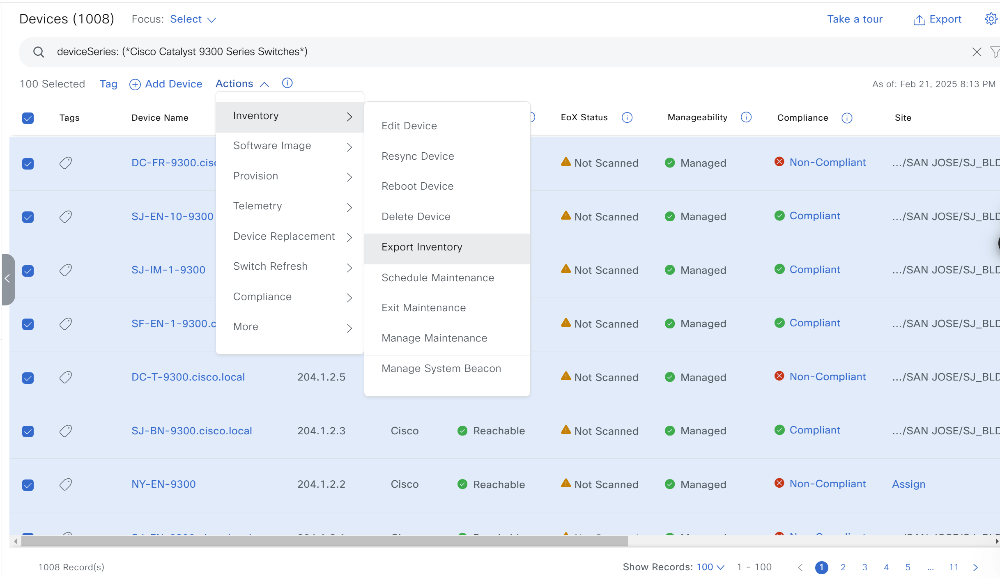

- Enter password and click Export


#### **Example Input **

```
device_configs_backup_details:
  - series_list: ['Cisco Catalyst 9300 Series Switches']
    file_path: "./"
```
- series_list: A list of series list for which the device configurations will be backed up.
- file_path: The directory path where the backup files will be stored.

### 9. Take Backup with site_list
#### **Mapping config to UI Actions**

- The config parameter within this task corresponds to the Provision > Inventory > Actions > Export Inventory" action in the Cisco Catalyst Center UI.

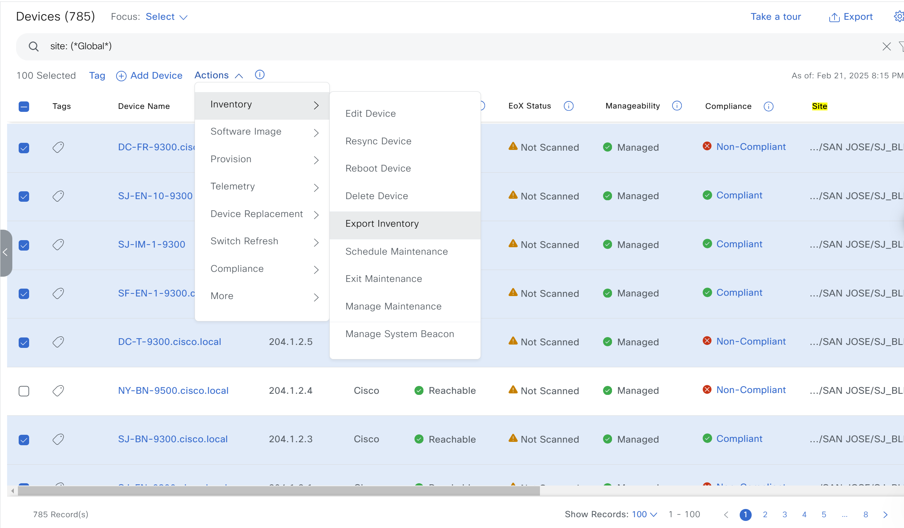

- Enter password and click Export


#### **Example Input **

```
device_configs_backup_details:
  - site_list: ['Global']
    file_path: "./"
```
- site_list: A list of site for which the device configurations will be backed up.
- file_path: The directory path where the backup files will be stored.


### 4. Backup using multiple parameters
Take Backup Using collection_status, ip_address_list and hostname_list

#### **Example Input **
- The config parameter within this task corresponds to the Provision > Inventory > Actions > Export Inventory" action in the Cisco Catalyst Center UI.

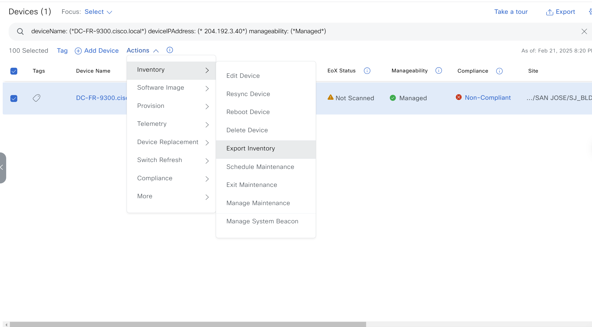

- Enter password and click Export


```
device_configs_backup_details:
  - ip_address_list: ['204.1192.3.40']
    hostname_list: ['DC-FR-9300.cisco.local']
    collection_status: Managed
    file_path: "./"
    unzip_backup: false
```


## IV. References

Note: The environment is used for the references in the above instructions.

```
  ansible: 9.9.0
  ansible-core: 2.16.10
  ansible-runner: 2.4.0

  dnacentersdk: 2.8.3
  cisco.dnac: 6.29.0
  ansible.utils: 5.1.2
```